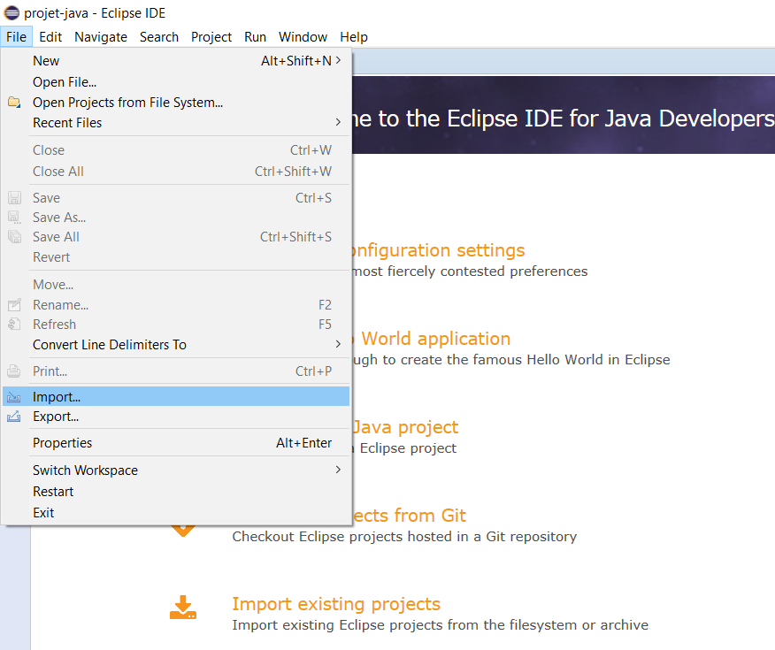
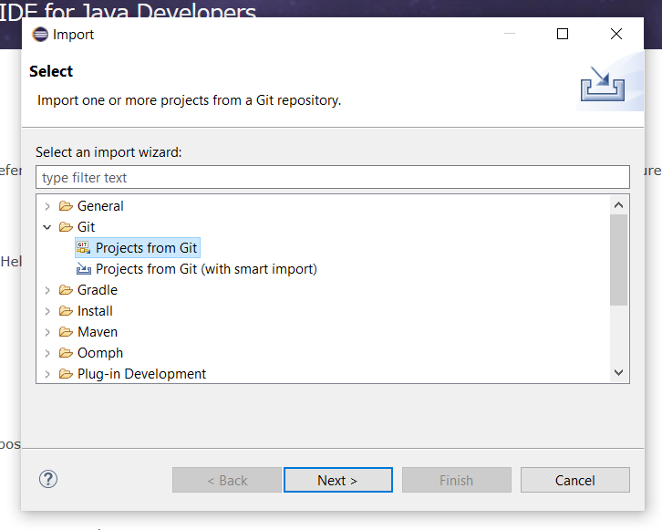

# Readme 

Voici mon projet Java pour le Callac Soft Collège Session 9 

## Description de l'application

 L'application est une sorte de plateforme de jeux, avec une interface utlisateur, création de compte et modification, une partie administrateur.
 Il y a aussi la possibiliter de jouer à un jeu (sur la règle du jeu des Kangourou)

## Installation 

### Logiciel Requis :
 Un logiciel de Base de données (Actuellement utiliser MySQL Workench)
 Eclipse (Version : 2019-09 R (4.13.0))
 Java jdk 12 (openJdk)

### Base de Donnée
 Ouvrez votre WorkBench, 
 Créer une nouvelle Base de données (Schémas)
 Ensuite ouvrez chaque script SQL en commencent par jeuxDuMob.sql, puis executez le script

### Lien GitLab
 Rendez vous sur la page principale du projet, puis copiez l'Url

 

 
### Lancez ECLIPSE
 Créer ou utiliser votre Workspace en cours

 Ensuite cliquez sur file, puis Import...

 

 Sélectionnez dans le répertoire Git, Project from Git

 Sélectionnez ensuite Clone URL 

 

Collez l'Url précédemment copiez dans la case Url,
Renseignez egalement votre nom de compte et mot de passe de GitLab dans la partie Authentification puis next

Cliquez sur Next, ensuite

Sélectionnez ensuite l'emplacement de téléchargement puis Next

Ensuite Next, et finish 

L’import ces normalement bien effectué.
Ensuite avant de lancer le projet nous devant renseigner l'adresse, l'user et le password de la base de données

Allez donc dans le fichier DataBase.java
    - renseigner à la ligne 17 entre le "/" et le "?" le nom de votre base de données
    - ligne 18 renseigner dans user :  votre nom user de votre base de données et dans pwsd : votre mot de passe d'acces a la base de données 

Une fois tout ceci fait vous aller enfin pouvoir tester le projet, 
Donc 
Cliquez sur la petite fleche noir qui est à droite du premier run (premiere fleche verte) et selectionné run As, puis java Application

Cliquez sur Ok 

Puis bon Test !

PS :  pour avoir accès à l'interface admin connecter vous avec 

Pseudo : admin
 mot de passe : admin

